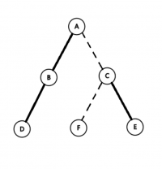
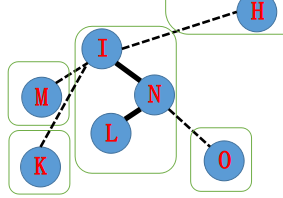
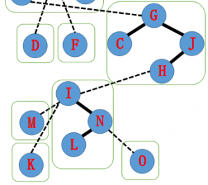
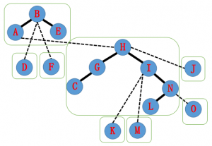
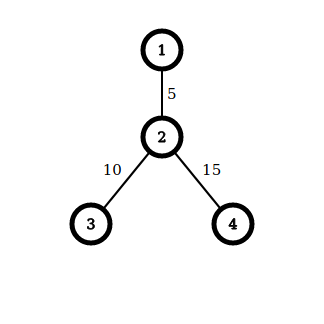
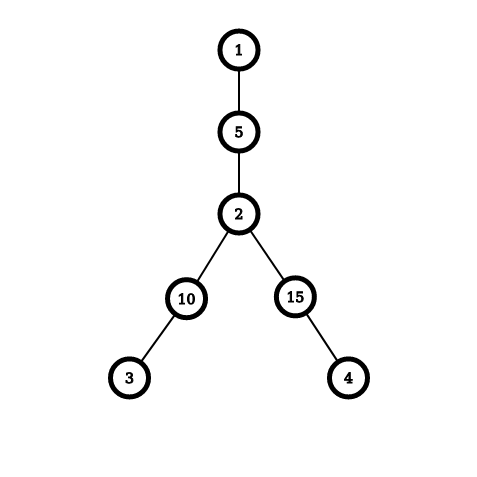

# Link/Cut Tree

## 简介

- Link/Cut Tree 是一种数据结构，可以在单次操作均摊 $O(\log n)$ 内解决**动态树问题**，并在大多数题目中复杂度吊打树链剖分。

- Splay 是 LCT 的基础，但是 LCT ⽤的 Splay 和普通的 Splay 在细节处不太一样（进行了一些扩展）。
- Link/Cut Tree 的复杂度证明略有难度，建议初学时跳过复杂度证明。

## 问题模型

Link/Cut Tree 能够维护一个**森林**, 支持一下操作

- 删除某条边，并保证操作后仍是森林
- 加⼊某条边，并保证操作后仍是森林
- 对于**某个结点**或者**某条链**进行修改
- 查询**某个结点**，**某条链**或者**指定某个点为根时的某个子树**的信息。

## 基础 LCT

### 实链剖分

回顾一下树链剖分的过程，我们本质上进行了如下的操作：

- 对整棵树按子树⼤小进⾏剖分，并重新标号
- 重新标号之后，树上形成了若干以链为单位的连续区间，于是可以用线段树等数据结构进⾏区间操作

转向动态树问题，我们发现树链剖分以子树⼤小作为划分条件，然而在动态树问题中，子树大小会动态变化，静态的划分无法保证复杂度。
此需要重新定义一种新的链划分方式——实链剖分，要求能够根据需求自由切换。

对于⼀个点连向它所有儿子的边 , 我们自行选择⼀条边为实边，其他边则为虚边。
对于实边，我们称它所连接的儿子为实儿子。
对于⼀条由实边组成的链，我们同样称之为实链。

选择实链剖分的最重要的原因：它是我们选择的，灵活且可变。
正是它的这种灵活可变性，我们采用 Splay Tree 来维护这些实链。

### 辅助树

我们可以简单的把 LCT 理解成用⼀些 Splay 来维护动态的树链剖分，以期实现动态树上的区间操作。
对于每条实链，我们建⼀个 Splay 来维护整个链区间的信息。

我们先来看⼀看辅助树的一些性质

- 原树每个节点与 Splay 的节点一一对应。
- 辅助树由多棵 Splay 组成，每棵 Splay 维护原树中的一条链，且该 Splay 的中序遍历满足结点深度递。
- 辅助树的各棵 Splay 之间并不是独立的。对于每棵 Splay 的根结点，如果该结点对应原树的根，则该结点的父亲为空，否则为该 Splay 对应实中最浅的结点在原树上的父亲，这条边对应原树的一条 **虚边**。因此，每棵树恰好有一个点的父亲节点为空。
- 由于辅助树的以上性质，我们维护任何操作都不需要维护原树，辅助树在任何情况下都能唯一确定原树，我们只需要维护辅助树即可。

**注意**：原树的根可能不是辅助树的根。

一个辅助树的例子：

如图，现在有⼀棵原树，加粗边是实边，虚线边是虚边。



由刚刚的定义，一棵可能的辅助树结构如下


辅助树有如下性质：

- 原树中的某条实链上的点，在辅助树中对应节点都在一棵 Splay 中。
- 辅助树是可以在满足辅助树、Splay 的性质下任意换根的。
- 虚实链变换可以轻松在辅助树上完成，这也就实现了动态维护树链剖分。

### 操作实现

#### 结点定义

```cpp
struct LCTNode {
  LCTNode *f = nullptr;
  LCTNode *s[2] = {nullptr, nullptr};
  bool rev = false;
  /* ... */
};
```

具体的解释：

+ `f`: 其在 Spaly 上的父亲
+ `s`: `s[0]` 代表该结点在 Splay 上的左儿子，`s[1]` 代表右儿子
+ `rev`: 子树翻转标记

根据维护的操作种类，我们可能还需要记录一些其他信息。

#### 和普通 Splay 相同的部分

```cpp
struct LCTNode  {
  void update();
  void push_up();
  void push_down();
  void reverse();
  void rotate();
  void splay();
};
```

一些注意点：

- 进行 `rotate` 的时候如果一个点连向父亲的便是虚边，不能更新该结点父亲的儿子信息（因为两者实际上并不在一棵 Splay 中）。
- 在普通 Splay 中，我们需要从根往下走才能定位某个结点，在这个过程中完成了 `push_down` 操作。但在 LCT 中，一个结点是直接通过在原树中的编号确定的，所以在实现 `splay` 的时候要先将该点所有的祖先 `push_down`。

#### 新操作

```cpp
struct LCTNode {
  void access();
  void make_root();
  LCTNode *find_root();
};

void link(LCTNode *u, LCTNode *v);
void split(LCTNode *u, LCTNode *v);
void split(LCTNode *u, LCTNode *v);
```

##### access

`access` 的功能是将该结点到根上的所有边变为实边，并将这个点的所有儿子变为虚儿子 。

假设我们有这样一棵树，实线为实边，虚线为虚边。


它的辅助树可能长成这样，每个绿框里是一棵 Splay。


现在我们要进行 `N->access()`, 把 $A$ 到 $N$ 路径上的边都变为实边，拉成一棵 Splay。


实现的方法是从下到上逐步更新 Splay。

首先我们要把 $N$ 旋至当前 Splay 的根。

为了保证辅助树的性质，原来 $N$ 到 $O$ 的实边要更改为虚边。

由于认父不认子的性质，我们可以单方面的把 $N$ 的儿子改为空。

于是原来的辅助树就从下图变成了下下图。




下一步，我们把 $N$ 的父亲 $I$ 也旋转到根。

原来的实边 $I \to K$ 要去掉，这时候我们把 $I$ 的右儿子指向 $N$, 就得到了 $I$—$L$ 这样一棵 Splay。



接下来，按照刚刚的操作步骤，由于 $I$ 的父亲为 $H$, 我们把 $H$ 旋转到他所在 Splay 的根，然后把 $H$ 的 **右儿子** 设为 $I$。

之后的树是这样的：



同理我们将 A 旋转到根， 并把 $A$ 的右儿子指向 $H$。

于是我们得到了这样一棵辅助树。并且发现 $A \to N$ 的整个路径已经在同一棵 Splay 中了。大功告成！


代码实现：

```cpp
void LCTNode::access() {
  Node *uu = this, *ss = nullptr;
  while (uu != nullptr) {
    uu->splay();
    uu->s[1] = ss;
    uu->push_up();
    ss = uu;
    uu = uu->f;
  }
}
```

总结一下，我们发现 `access` 有如下四步操作：

1. 把当前节点转到根
2. 把儿子换成之前的节点
3. 更新当前点的信息
4. 把当前点换成当前点的父亲，继续操作

##### make_root

我们在需要维护路径信息的时候，会出现路径深度无法严格递增的情况。根据辅助树的的性质，这种路径是不能出现在一棵 Splay 中的。因此，我们需要一种操作，将一个点变成原树的根。

考虑一次换根做了什么，假设原先根为 $R$，当前结点为 $U$，我们需要将 $R \to U$ 的路径翻转，变为 $U \to R$。因此我们只需要将 $U$ 结点 `access`，然后将这棵 Splay 翻转。

代码实现：

```cpp
void LCTNode::make_root() {
  access();
  splay();
  reverse();
}
```

##### find_root

`find_root` 返回一个森林的根，常用于判断两个点是否属于同一联通块。

将该点 `access`、`splay` 后，该联通块的根即为 Splay 中最左侧的点，直接不断往搜索走即可。

注意这里在大部分情况下不需要 `push_down`，如果为了保险起见也可以写上。

注意找到根以后需要将根 `splay` 以保证复杂度。

代码实现：

```cpp
LCTNode *LCTNode::find_root() {
  access();
  splay();
  LCTNode *uu = this;
  uu->push_down();
  while (uu->s[0] != nullptr) {
    uu = uu->s[0];
    uu->push_down();
  }
  uu->splay();
  return uu;
}
```

##### link

`link` 操作将原树上的两个点之间加边（虚边）

做法非常显然，先将一个点变为根，然后将其的父亲设为另一个结点。

代码实现：

```cpp
void link(LCTNode *u, LCTNode *v) {
  u->make_root();
  u->f = v;
}
```

##### split

`split` 操作将两点之间的路径提取出来，便于查询。

先将其中的一个点 `make_root`，这样这条路径的深度严格递增。将另外一个点 `access` 再 `splay` ，这样这个点上的信息就是该路径的信息

代码实现：

```cpp
void split(LCTNode *u, LCTNode *v) {
  u->make_root();
  v->access();
  v->splay();
}
```

##### cut

断边操作有两种情况，保证合法和不一定保证合法。

如果保证合法，那么直接将这两个点 `split` 出来，此时这两个点之间连的是实边，直接在 Splay 上切断即可。

保证合法的代码实现：

```cpp
void cut(LCTNode *u, LCTNode *v) {
  split(u, v);
  v->s[0] = u->f = nullptr;
  v->push_up();
}
```

如果是不保证合法，我们需要判断一下两个点之间是否有边。判断的条件为：

+ 两个点在同一个联通块内
+ 两个点的距离为 1

判断距离可以直接看 Splay 的大小。

不保证合法的代码实现：

```cpp
void cut(LCTNode *u, LCTNode *v) {
  if (u->find_root() != v->find_root())
    throw std::invalid_argument("u is not directly connected with v!");
  split(u, v);
  if (v->s[1] != nullptr ||
      u->s[0] != nullptr ||
      u->s[1] != nullptr)
    throw std::invalid_argument("u is not directly connected with v!");
  v->s[0] = u->f = nullptr;
  v->push_up();
}
```

#### 完整实现（以维护链异或和为例）

```cpp
// Copyright (C) 2018-2020 Jacder Zhang

// This program is free software: you can redistribute it and/or modify
// it under the terms of the GNU General Public License as published by
// the Free Software Foundation, either version 3 of the License, or
// (at your option) any later version.

// This program is distributed in the hope that it will be useful,
// but WITHOUT ANY WARRANTY; without even the implied warranty of
// MERCHANTABILITY or FITNESS FOR A PARTICULAR PURPOSE.  See the
// GNU General Public License for more details.

// You should have received a copy of the GNU General Public License
// along with this program. If not, see <https://www.gnu.org/licenses/>.


#include <bits/stdc++.h>

struct LCTNode {
  LCTNode *f = nullptr;
  LCTNode *s[2] = {nullptr, nullptr};
  bool rev = false;
  int val = 0, sum = 0;

  bool is_root();
  bool get_son();
  void push_up();
  void reverse();
  void push_down();
  void push();
  void rotate();
  void splay();
  void access();
  void make_root();
  LCTNode *find_root();
};

bool LCTNode::is_root() {
  return f == nullptr || 
         (f->s[0] != this && f->s[1] != this);
}

bool LCTNode::get_son() {
  return this == f->s[1];
}

void LCTNode::push_up() {
  sum = val;
  if (s[0] != nullptr) sum ^= s[0]->sum;
  if (s[1] != nullptr) sum ^= s[1]->sum;
}

void LCTNode::reverse() {
  rev = !rev;
  std::swap(s[0], s[1]);
}

void LCTNode::push_down() {
  if (rev) {
    if (s[0] != nullptr) s[0]->reverse();
    if (s[1] != nullptr) s[1]->reverse();
    rev = false;
  }
}

void LCTNode::push() {
  if (!is_root()) f->push();
  push_down();
}

void LCTNode::rotate() {
  LCTNode *const uu=this, *ff=f, *aa=ff->f;
  bool ss = uu->get_son();
  if (!ff->is_root()) aa->s[ff->get_son()] = uu;
  ff->f = uu, ff->s[ss] = uu->s[!ss];
  uu->f = aa; uu->s[!ss] = ff;
  if (ff->s[ss] != nullptr) ff->s[ss]->f = ff;
  ff->push_up(), uu->push_up(); 
}

void LCTNode::splay() {
  push();
  while (!is_root()) {
    if (f->is_root()) {
      rotate();
      return;
    }
    (get_son() == f->get_son() ? f : this)->rotate();
    rotate(); 
  }
}

void LCTNode::access() {
  LCTNode *uu = this, *ss = nullptr;
  while (uu != nullptr) {
    uu->splay();
    uu->s[1] = ss;
    uu->push_up();
    ss = uu;
    uu = uu->f;
  }
}

void LCTNode::make_root() {
  access();
  splay();
  reverse();
}

LCTNode *LCTNode::find_root() {
  access();
  splay();
  LCTNode *uu = this;
  uu->push_down();
  while (uu->s[0] != nullptr) {
    uu = uu->s[0];
    uu->push_down();
  }
  uu->splay();
  return uu;
}

void link(LCTNode *const u, LCTNode *const v) {
  if (u->find_root() == v->find_root())
    throw std::invalid_argument("u and v are already connected");
  u->make_root();
  u->splay();
  u->f = v;
}

void split(LCTNode *const u, LCTNode *const v) {
  u->make_root();
  v->access();
  v->splay();
}

void cut(LCTNode *u, LCTNode *v) {
  if (u->find_root() != v->find_root())
    throw std::invalid_argument("u is not directly connected with v!");
  split(u, v);
  if (v->s[1] != nullptr ||
      u->s[0] != nullptr ||
      u->s[1] != nullptr)
    throw std::invalid_argument("u is not directly connected with v!");
  v->s[0] = u->f = nullptr;
  v->push_up();
}

constexpr int N = 100005;
LCTNode p[N];

int main() {
  int n, m;
  scanf("%d%d", &n, &m);
  for (int i=1; i<=n; ++i) {
    scanf("%d", &p[i].val);
  }

  for (int i = 0; i < m; ++i) {
    int opt, u, v;
    scanf("%d%d%d", &opt, &u, &v);
    
    if (opt == 0) {
      split(&p[u], &p[v]);
      printf("%d\n", p[v].sum);
    } else if (opt == 1) {
      try {
        link(&p[u], &p[v]);
      } catch (...) {}
    } else if (opt == 2) {
      try {
        cut(&p[u], &p[v]); 
      } catch (...) {}
    } else {
      p[u].splay();
      p[u].val = v;
      p[u].push_up();
    }
  }
  return 0;
}
```


## LCT 进阶

###  维护边信息

LCT 的辅助树只能方便的维护点的信息，不能维护边的信息。

如果题目要求维护边的信息，则可以采用边转点的技巧，即对于每一条边，新增一个点记录边上的信息。

假如有如下原树：



边转点以后得到：



### 维护子树信息

查询原树子树信息需要在每个结点上记录其虚儿子的信息，并在虚实链切换时维护这些信息。

与普通 LCT 不同，维护子树信息的 LCT 需要在每个结点上维护一下信息（以子树和为例）：

+ `vtot`：该点所有虚儿子的 `atot` 之和，加上该点权值
+ `atot`：该点的 `vtot` 加上 Splay 上左右儿子的 `atot`

根据上述定义，我们需要修改普通 LCT 的以下函数：

+ `push_up`：根据 `atot` 的定义进行操作
+ `access`：该过程中会进行虚实边切换，需要维护 `vtot`
+ `link`：该操作新增一条虚边，需要维护 `vtot`

注意 `cut` 操作切断的是实边，无需维护 `vtot`

具体实现：

```cpp
void LCTNode::push_up() {
  atot = vtot;
  if (s[0] != nullptr) atot += s[0]->atot;
  if (s[1] != nullptr) atot += s[1]->atot;
}

void LCTNode::access() {
  LCTNode *uu = this, *ss = nullptr;
  while (uu != nullptr) {
    uu->splay();
    // uu->s[1] 从实儿子变为虚儿子
    if (uu->s[1] != nullptr)
      uu->vtot += uu->s[1]->atot;
    uu->s[1] = ss;
    // ss 从虚儿子变为实儿子
    if (uu->s[1] != nullptr) 
      uu->vtot -= uu->s[1]->vtot;
    uu->push_up();
    ss = uu;
    uu = uu->f;
  }
}

void link(LCTNode *u, LCTNode *v) {
  u->make_root();
  // 如果不对 v 进行 make_root 的话 v 的祖先的虚子树信息无法得到更新
  v->make_root();
  u->f = v;
  v->vtot += u->atot;
  // 因为修改了 v 的信息所以要 push_up 
  v->push_up();
}
```

## 例题

### [SDOI2008] Cave

>有 $n$ 个点，一开始没有连边。有 $m$ 次操作，操作有 3 种类型：
>
>+ 连接某两个点
>
>+ 断开某一条边
>
>+ 还有一种是询问两个点是否连通。
>
>操作过程中保证整个图是森林。

直接用 LCT 进行连边和删边，用 `find_root` 判断联通性即可。

### [WC2006] 水管局长

>$n$ 个点的图，$m$ 条带权边,有 $q$ 次操作，操作有两种类型：
>
>+ 在节点 $x$ 到 $y$ 的之间所有路径中找一条路径，使得这条路径上的最大边权尽量小，输出这个最小值。
>+ 删除某一条边
>
>操作过程中保证图连通。

运用“时光倒流”的技巧，先假设所有边都被删掉，然后倒过来一边加边一边回答询问。

加边的时候如果发现两个点已经联通，那么就找到两个点路径上权值最大的边，如果当前的边权值比这条边小，那么找到的这条边以后都不会出现在最优路径中，因此可以删掉，用新加入的这条边替换。这样可以保证我们维护的始终是一个森林。

找到路径上权值最大的边需要用到边转点的技巧。

### Codechef MARCH14 GERALD07

>$N$ 个点 $M$ 条边的无向图，询问保留图中编号在 $[l,r]$ 的边的时候图中的联通块个数。

首先，将边按照编号顺序依次加入图中。每当出现环时，将环中最早加入的边弹出。记第 $i$ 条边被弹出的时间为 $T_i$ ，表示在第 $T_i$ 条边加入的时候，第 i 条边被弹出了。

联通块个数等于点数减生成森林的边树。对于一个时间区间 $[l,r]$，满足 $l \leq i \leq r <T_i $ 的边会出现在生成森林中，于是就把问题转化为二维数点，可以使用可持久化线段树或离线后用树状数组解决。

### 最小差值生成树

>给定 $N$ 个点，$M$ 条变的图，求边权极差最小的生成树。

考虑确定生成树边权的最大值，求出该情况下生成树边权最小值的最大值。

按照边权从小到大加边，如果两点已经联通则删去两点之间权值最小的边，维护树边中权值最小值即可。

### [UOJ207] 共价大爷游长沙

>给定一个 $n$ 个节点的树，有 $m$ 次操作，操作有以下 $4$ 种类型：
>
>+ 给定四个正整数 $x,y,u,v$，表示先删除连接点 $x$ 和点 $y$ 的无向边，保证存在这样的无向边，然后加入一条连接点 $u$ 和点 $v$ 的无向边，保证操作后的图仍然是一棵树。
>+ 给定两个正整数 $x,y$，表示在 $S$ 中加入点对 $(x,y)$。
>+ 给定一个正整数 $x$，表示删除第 $x$ 个加入 $S$ 中的点对，即在第 $x$ 个操作 2 中加入 $S$ 中的点对，保证这个点对存在且仍然在 $S$ 中。
>+ 给定两个正整数 $x,y$，询问连接点 $x$ 和点 $y$ 的边是否属于 $S$ 集合中的所有路径的交集，保证存在这样的无向边且此时 $S$ 不为空。

首先，我们发现询问一条边 $(x,y)$ 是否是所有路径的交集，可以转化成将 $x$ 变成根，询问在 $S$ 集合中的每一条路径是否都有且仅有一个端点出现在 $y$ 子树中。

于是，问题转化成了维护子树信息。对于每一条路径的两端点，我们随机一个值，并将两个端点的权值异或上该值，于是原问题就变成了 LCT 维护子树节点权值异或和 。

### [ZJOI2018] 历史

> 给一棵树，点有点权 $a_i$。第 $i$ 个点要 `access` 恰好 $a_i$ 次，要求构造一个 `access` 的顺序最大化轻重边切换次数，你还要支持增大一个点的点权。

首先我们得有一个多项式复杂度的玩意。

钦定两次 `access` 在 `LCA` 处贡献。那么枚举 `LCA` ，将子树 $x$（以及自己的点权）中的所有 `access` 看成一种，那么我们得到的问题就是，有若干不同颜色的球 ，你要将他们排列起来，最大化相邻的异色球数量。

这是一个经典问题，记 $S$ 为球数和，$\textit{maxv}$ 为出现次数最多的球的出现次数，则：

- 若$S-\textit{maxv}< \textit{maxv}$，则应该用其他所有球去和最多的球拼（最多的球也还有剩余，即$2(S-\textit{maxv})$

- 否则，最多的球能完全贡献（不会同色相邻），并且可以证明所有球都能完全贡献，即$S-1$

做一个树形dp就好了，复杂度 $O(n)$。

接下来考虑怎么支持修改。

性质1：记 $y$ 为 $x$ 出现次数严格大于一半的儿子（可能不存在，那就留空），那么当 $x$ 的子树中点权增大时，$y$ 仍为 $x$ 出现次数严格大于一半的儿子，并且 $x$ 的贡献不变。

性质2：任意一个点到根，大部分都是从出现次数严格大于一半的儿子走到父亲，不是这样的只有$\log \sum a_i$ 条。

那么就可以想到，将出现次数严格大于一半的儿子记为实儿子，用LCT维护，不存在就留空（为了避免实儿子是自己，可以新建一个点把点权放在上面）。

修改的时候，我们魔改 LCT 的 `access` 操作（由性质1，实链上的点只有链底可能变化），判断一下是否割掉原本的实儿子，是否将现在的点作为新的实儿子即可，同时统计贡献。

由性质2，一个点到根只有 $O(\log \sum a_i)$ 条实链，每条实链上 splay 代价 $O(\log n)$，那么一个显然的上界是每次均摊 $O(\log n\log \sum a_i)$。

凭什么都是 LCT 魔改后要多一只 $\log$？

> 你可以拿起笔，在草稿纸上涂涂画画，写下一堆形如 $\phi + \sum f'(x) − \sum f(x)$ 的东西，然后拍案而起：“这样做复杂度是 $O(\log n + \log \sum a_i)$ 的！”

## 后记

> 如果你不是熟练的 OI 选手，没有关系，百度上有本文所需的所有前置知识。
>
> 本文中没有复杂度分析，因为分析的方法很多，无论你是 $\phi + \sum f'(x) − \sum f(x)$ 的均摊分析选手，还是运算次数每加一规模减半的毛估估大师，都可以轻松得到正确的复杂度。
>
> 然而这并没有什么用，因为理论复杂度与运行效率没有直接关系，LCT 只能出成交互题卡卡交互次数，树链剖分还是得学的。
>
> 出题人一般是比较懒的，只会造菊花加链加二叉树。

参考文献：

- [1]: 董永建，宋新波，徐先友等，《信息学奥赛一本通 (C++ 版)》，科学技术文献出版社

- [2]: 张哲宇, 浅谈树上分治算法, IOI2019 中国国家候选队论文集, 2019

- [3]: [Link Cut Tree - OI wiki](https://oi-wiki.org/ds/lct/)

- [4]: [LCT入门教程 - zzd233](https://www.cnblogs.com/zhouzhendong/p/LCT.html)

- [5]: [均摊分析 学习笔记 - zzd233](https://www.cnblogs.com/zhouzhendong/p/JunTanFenXi.html)

